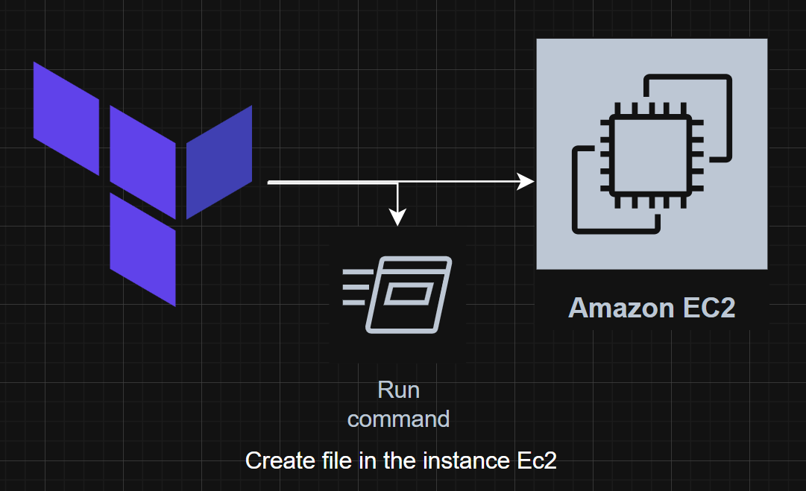

# Ec2.MongoDB.Terraform.Aws
This Terraform configuration sets up a simple AWS infrastructure with an EC2 instance and with a security group. The instance runs a user data script that pings Google upon startup. You can customize the instance name, AMI ID, and other parameters through the `qa.tfvars` file.

## Diagram


## Requirenments:
- Terraform installed
- Aws account
- Aws Key Pair (test.pem)
- Create qa.tfvars file
- Define variables in qa.tfvars

## Steps with terraform
1. Terraform init and terraform workspace
```
terraform init
terraform workspace new qa
terraform workspace select qa
```

2. Terraform plan
```
terraform plan -var-file qa.tfvars
```
3. Terraform apply
```
terraform apply -var-file qa.tfvars
```
